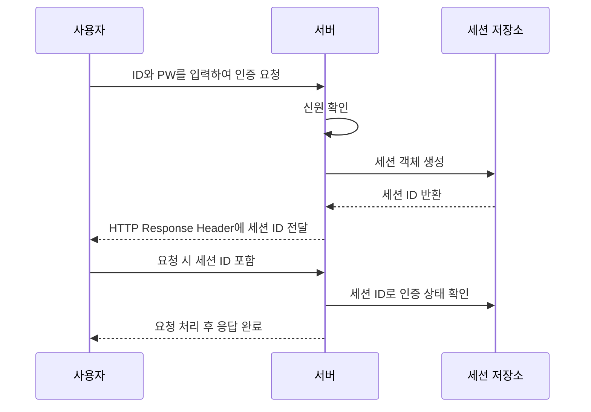
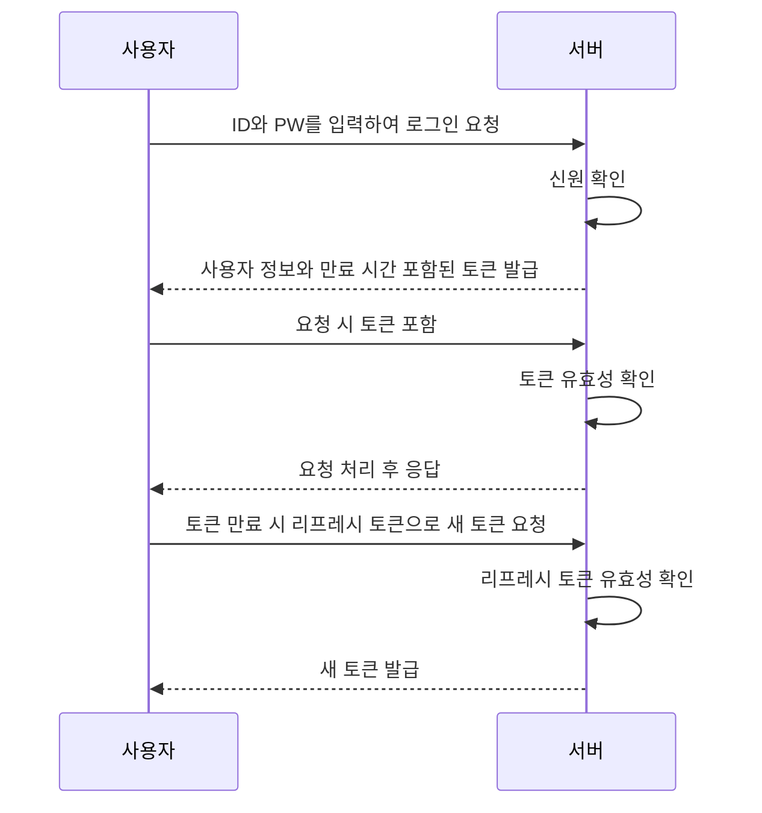

## 개요

우리는 각종 서비스를 이용하기 위해 회원 가입을 하고 로그인을 합니다. 로그인은 사용자가 서비스에 나의 **신원을 확인하는 과정**이라고 할 수 있습니다. 시스템은 사용자가 입력한 정보를 통해 신원을 확인하고, 정상적일 경우 시스템에 접근할 수 있는 권한을 부여해줍니다. 이렇게 사용자의 신원이 실제로 유효한지 검증하는 작업이 **인증**입니다.

사용자가 로그인을 통해 시스템 접근 권한을 획득하게 되면 사용자의 민감한 정보에도 접근할 수 있게 됩니다. 송금 서비스의 경우 사용자의 잔고를 확인하고, 사용자의 계좌에 있는 자산을 다른 사람에게 송금할 수도 있습니다. 이와 같은 요청을 누군가 인증을 가로채 사용자의 자산을 갈취해간다면 이는 큰 문제가 됩니다.

이와 같은 문제를 예방하기 위해 로그인 기능을 설계할 때는 보안과 성능을 균형 있게 고려해야 합니다. 이러한 배경 지식을 가지고서 대표적인 로그인 인증 방식인 세션 기반 인증과 토큰 기반 인증에 대해 알아보고자 합니다.

## 세션 기반 인증

세션 기반 인증은 사용자가 시스템에 로그인한 후, 서버가 사용자와의 연결 상태를 서버 측에서 관리하며 인증 정보를 유지하는 방식입니다. 이 방식은 사용자가 한 번 로그인에 성공하면, 서버가 이후 요청에서도 사용자가 유효한 사용자임을 확인해줍니다. 

세션 기반 인증의 동작 원리는 다음과 같습니다.

- 사용자가 ID와 PW를 입력하여 서버에 로그인 요청을 보냅니다.
- 서버는 사용자가 입력한 ID와 PW를 통해 신원을 확인하고, 인증이 정상적일 경우 사용자와 서버 간의 상태 정보를 담은 세션 객체를 생성합니다.
- 생성된 세션의 ID는 HTTP Response Header의 Set-Cookie 필드에 담겨 클라이언트로 전달합니다.
- 이후 사용자는 서버에 요청을 보낼 때마다 쿠키에 포함된 세션 ID를 함께 전송합니다.
- 서버는 해당 세션 ID로 사용자의 인증 상태를 확인하고 요청을 처리합니다.

세션 기반 인증은 사용자의 민감한 데이터를 서버에서 관리하고, 클라이언트에 노출하지 않아 보안에 안전합니다.

하지만 세션 기반 인증에는 명확한 단점으로 확장성 문제가 존재합니다.

- 세션의 상태를 서버에서 관리하기 때문에 사용자가 많아질수록 서버의 부하가 증가합니다.
- 로드 밸런싱을 위해 서버를 여러대 둘 경우 세션 동기화가 필요합니다.

## 토큰 기반 인증

토큰 기반 인증은 사용자가 로그인하여 인증에 성공하면, 서버가 **토큰을** 클라이언트에 전달하는 방식입니다. 클라이언트는 서버에서 발급받은 토큰을 요청에 포함하여, 자신의 인증 정보를 증명하고 요청이 처리됩니다. 서버는 이를 확인하여 사용자의 신원을 검증합니다.

토큰 기반 인증의 동작 원리는 다음과 같습니다.

- 사용자가 ID와 PW를 입력하여 서버에 로그인 요청을 보냅니다.
- 서버는 사용자가 입력한 ID와 PW를 통해 신원을 확인하고, 인증이 정상적일경우 사용자 정보와 만료 시간 등을 담은 토큰을 발급합니다.
- 클라이언트는 이후 요청을 보낼 때 토큰을 포함하여 서버로 전송합니다.
- 서버는 클라이언트가 보낸 토큰의 유효성을 확인하고, 토큰이 유효하면 요청을 처리합니다.
- 토큰이 만료되면 클라이언트는 서버에 리프레시 토큰을 사용하여 새로운 토큰을 요청합니다.

토큰 기반 인증은 서버가 토큰의 상태를 저장할 필요가 없어 추가적인 저장소나 동기화 작업이 필요하지 않습니다. 이러한 특징 덕분에 여러 서버가 동일한 토큰을 검증할 수 있어 분산 서버 환경에서 용이합니다.

하지만 클라이언트 측에서 토큰이 탈취될 경우 토큰이 악용될 가능성이 있기 때문에 보안에 유의해야합니다. 이러한 단점을 보완하기 위해 토큰의 유효 시간을 짧게 설정하고, 리프레시 토큰을 통해 추가 인증 단계를 도입합니다.

## 결론

세션 기반 인증은 단일 서버 환경에서 적합한 방식입니다. 반면, 토큰 기반 인증은 분산 시스템에서 확장성이 뛰어나며 Restful API 설계에 적합합니다. 따라서 인증 방식은 애플리케이션의 요구사항에 따라 선택해야 합니다. 이때 두 방식 모두 보안을 최우선으로 고려해야합니다.
