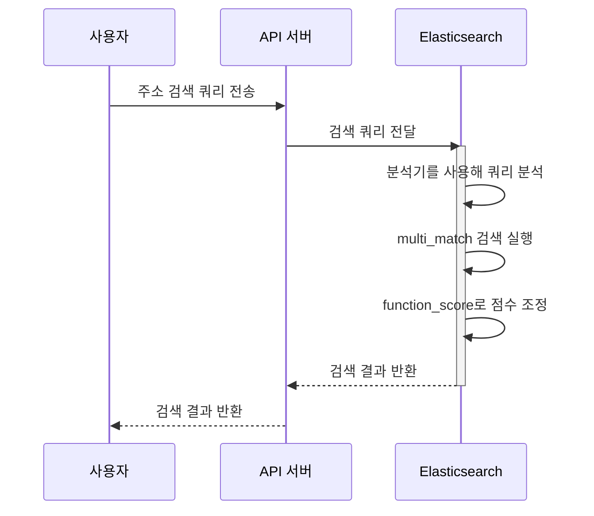

# Elasticsearch 소개와 주소 검색이 처리되는 과정

## Elasticsearch란

Elasticsearch는 `Apache Lucene` 을 기반으로 구축된 데이터 저장소이자 Vector DB

다음과 같은 기능을 제공

- **search**
    - Full-text search
    - Semantic search
    - Vector database
    - Hybrid search
    - …
- observabiliy
- security

Elasticsearch에는 내장 plugin이 존재, 여기에는 다양한 plugin을 조합하여 사용할 수 있음 [링크](https://www.elastic.co/guide/en/elasticsearch/plugins/8.17/intro.html)

- 내장 plugin ([더보기](https://github.com/elastic/elasticsearch/tree/main/plugins))
    - analysis-icu
    - analysis-kuromoji
    - **analysis-nori**
    - analysis-phonetic
    - analysis-smartcn
    - analysis-stempel
    - analysis-ukrainian

더 상세한 엘라스틱 서치의 기능은 다음 [링크](https://www.elastic.co/elasticsearch/features)를 참조

## 주소 검색이 처리되는 과정

- Elasticsearch 설정
    - 분석기와 필터 설정
        - `ngram_filter`
            - 텍스트를 n-gram으로 나눠 부분 문자열 검색을 지원
        - `search_address_analyzer` (custom)
            - 한국어 처리를 위한 nori_tokenizer
            - 한글 읽기 형태 변환 nori_readingform
            - …
        - `ngram_analyzer`
            - n-gram 필터를 결합해 부분 검색 지원
- 데이터 매핑 정의
    - 데이터를 Elasticsearch에 저장할 때 각 필드의 데이터 타입과 분석 방식 정의
        - 주로 숫자는 `keyword`, 문자는 `text` (부분 검색 처리를 위해)
        - 지번 주소
        - 도로명 주소
        - 시도군구, 읍면동, 건물번호 등등
- 데이터 색인
    - 데이터가 Elasticsearch에 삽입될경우 각 필드에 대해 매핑에서 지정한 분석기를 사용하여 텍스트를 분석하고 색인 처리(**Inverted Index** 구조)
- 검색 쿼리
    
    ```json
    {
      "function_score": {
         "query": {
           "multi_match": {
             "query": "?0",
             "fields": ["road_address", "land_lot_address"]
           }
         },
         "functions": [
           {
             "filter": {
               "term": {
                 "road_address.keyword": "?0"
               }
             },
             "weight": 10
           },
           {
             "filter": {
               "term": {
                 "land_lot_address.keyword": "?0"
               }
             },
             "weight": 10
           }
         ],
         "score_mode": "max"
       }
    }
    ```
    
    - function_scroe: 특정 조건에서 점수에 가중치 부여
    - multi_match: 여러 필드에서 입력 쿼리로 검색
        - (위에서 설정한) 분석기로 분석된 데이터를 기반으로 검색
    - filter.term: 정확한 값 일치를 기준으로 필터링
        - 정확히 일치하는 데이터가 있을 경우 가중치 적용
    

### 시퀀스 다이어그램



## Reference

- Elastic 공식 문서
