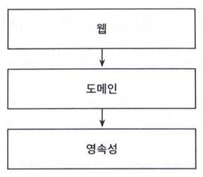
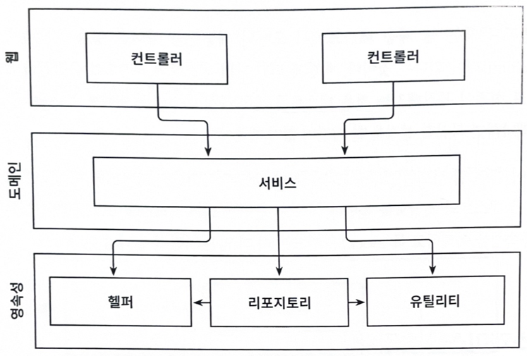

# 1. 계층형 아키텍처의 문제

- 전통적인 웹 애플리케이션 구조인 3-tier architecture  
  
- 전통적인 계층형 아키텍처의 토대는 데이터베이스
  - web -> domain
  - domain -> **persist**
- 계층형 아키텍처는 데이터베이스 주도 설계를 유도
  - 그동안 만든 애플리케이션의 유스케이스를 떠올려보면 데이터베이스의 구조를 생각하고, 이를 토대로 도메인 로직을 구현
  - 비즈니스 관점에서 로직을 제대로 이해했는지 확인하기 위해서는 도메인 로직을 먼저 만들어야함
  - 도메인 로직이 맞다는 것을 확인한 뒤 이를 기반으로 영속성 계층과 웹 계층을 만들어야함
- ORM 또한 데이터베이스 중심적인 아키텍처를 유도
  - 일반적으로 ORM 에 의해 관리되는 엔티티를 영속성 계층에 둠
  - 이렇게 되면 영속성 계층과 도메인 계층 사이에 강한 결합이 생김
  - 서비스는 영속성 모델을 비즈니스 모델처럼 사용하게 되고, 즉시로딩/지연로딩, DB 트랜잭션, 캐시 플러시 등 영속성 계층과 관련된 작업들을 해야함
  - 영속성 코드가 도메인 코드에 녹아들어가서 둘 중 하나만 바꾸는 것이 어려워짐
- 계층을 건너뛸 경우(웹 -> 영속성 접근)
  - 하나의 필드를 조작하는 경우에도 도메인 로직을 웹 계층에서 구현
  - 유스케이스가 확장되면서 애플리케이션 전반적으로 책임이 섞이고 핵심 도메인 로직이 퍼져나가게됨
  - 웹 계층 테스트 시 도메인 계층과 함께 영속성 계층을 모킹하게 되면서 단위 테스트 복잡도가 높아짐
  - 테스트가 복잡해지면서 점점 더 테스트를 작성하지 않게될 가능성도 존재
- 도메인 서비스의 '너비'에 관한 규칙을 강제하지 않음
  - 그렇기 때문에 아래와 같이 비대한 서비스가 만들어지기도함 
  
  - 넓은 서비스는 영속성 계층에 많은 의존성을 갖게 되고, 웹 계층의 많은 컴포넌트가 이 서비스에 의존하게 됨
  - 서비스를 테스트하기도 어려워지고, 작업해야할 유스케이스를 책임지는 서비스를 찾기도 어려움
