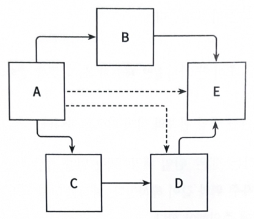
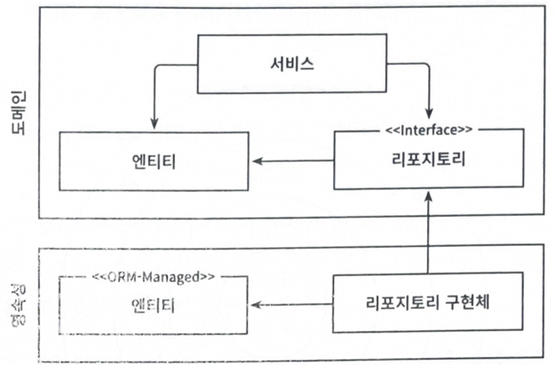
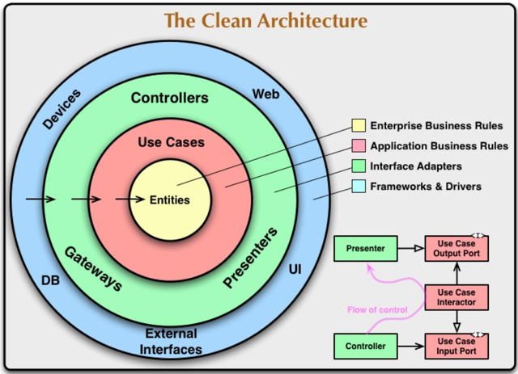
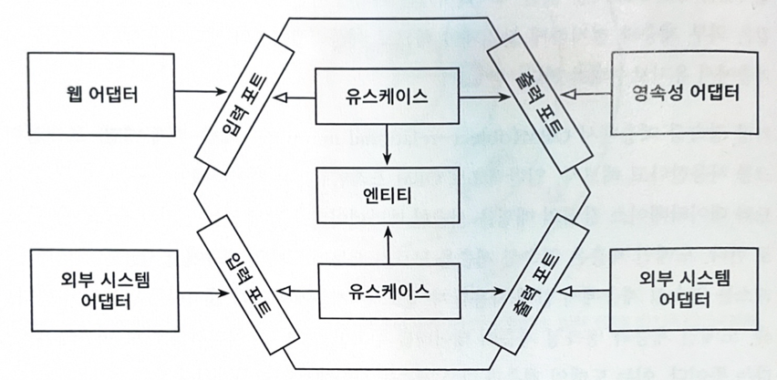

# 의존성 역전하기

## 단일 책임 원칙

**단일 책임 원칙의 오해**
- 일반적으로 단일 책임 원칙을 '하나의 컴포넌트는 오로지 한 가지 일만 해야 하고, 그것을 올바르게 수행해야 한다' 라고 해석
- 하지만 이는 직관적으로 해석한 것으로, 실제 정의는 '컴포넌트를 변경하는 이유는 단 하나여야만 한다' 라고 함
- 단일 책임에서의 책임은 `한 가지 일`이 아닌 `변경할 이유`로 해석

  

**단일 책임 원칙 위반 사례**

- 컴포넌트 A는 다른 여러 컴포넌트를 의존하는 반면 컴포넌트 E는 어느 컴포넌트도 의존하지 않음
- 컴포넌트 A의 경우 모든 컴포넌트를 의존하고 있어 다른 어떤 컴포넌트가 바뀌면 같이 바뀌어야함
- 이는 단일 책임 원칙을 위반하는게 변경 비용을 증가한다는 사례를 제시하고 있음
- 변경할 이유가 많이 쌓인 후 컴포넌트를 바꾸는 것이 다른 컴포넌트가 실패하는 원인으로 작용할 수 있음

  

## 의존성 역전 원칙

- 계층형 아키텍처에서 계층 간 의존성은 항상 다음 계층인 아래 방향을 가리킴
- 영속성 계층에 대한 도메인 계층의 의존성 때문에 영속성 계층이 변경되면 도메인 계층도 그 영향을 받게됨
- 이러한 의존성을 제거하는 방법으로 `의존성 역전 원칙`을 제시

   

**의존성 역전 동작 예시**

- 엔티티는 도메인 객체를 표현, 도메인 로직은 이 엔티티의 상태를 변경하는 일을 중심으로 하기 때문에 엔티티를 도메인 계층으로 올림

  

**로버트 C. 마틴, 클린 아키텍처**

- 로버트 C. 마틴은 클린 아키텍처를 아래와 같이 이야기함
  - 클린 아키텍처에서는 설계가 비즈니스 규칙의 테스트를 용이하게 해줌
  - 비즈니스 규칙은 프레임워크, 데이터베이스, UI, 그 밖의 외부 애플리케이션이나 인터페이스로부터 독립적일 수 있다고 함  
    -> 이는 도메인 코드가 바깥으로 향하는 어떤 의존성도 없어야 함을 의미  
    -> 또한 DIP의 도움으로 모든 의존성이 도메인을 향하고 있음

  

- 클린 아키텍처에서 가장 중요한 규칙은 의존성 규칙, 계층 간 모든 의존성이 안쪽으로 향해야함
- 계층형 아키텍처의 서비스를 유스케이스로 칭하고, 단일 책임을 갖기 위해 더 세분화되어있음  
  -> 넓은 서비스 문제를 피할 수 있게됨
- 클린 아키텍처의 코어는 애플리케이션 계층과 도메인 계층을 합친 것
  - 코어 주변으로 비즈니스 규칙을 지원하는 애플리케이션의 다른 컴포넌트가 존재
- 바깥쪽 계층은 서드파티 컴포넌트에 어댑터를 제공
- 도메인 로직에서는 특정 영속성 프레임워크나 UI 프레임워크가 사용되는지 알 수 없기에 특정 프레임워크에 특화된 코드가 아닌 비즈니스 규칙에 집중할 수 있게됨

  

**클린 아키텍처에서의 ORM 프레임워크**

- ORM 프레임워크를 사용하기 위해서는 엔티티 클래스가 필요함
- 클린 아키텍처에서 도메인 계층은 영속성 계층을 알 수 없음
  - 도메인 계층에서 사용하는 엔티티 클래스를 영속성 계층에서 함께 사용할 수 없음
  - 각 계층에서 사용하는 엔티티 클래스가 필요하며 도메인 계층과 영속성 계층이 데이터를 주고받을때, 두 엔티티를 서로 변환해야함 

  

**육각형 아키텍처(헥사고날 아키텍처)**

- 클린 아키텍처와 마찬가지로 모든 의존성이 코어를 향하고 있음
- 육각형의 바깥에는 외부와 상호작용하는 어댑터들이 존재
  - 왼쪽의 어댑터(웹 어댑터, 왼쪽의 외부 시스템 어댑터)는 애플리케이션 코어를 호출하기 때문에 애플리케이션을 주도하는 어댑터(driving adapter)라고 할 수 있음
  - 오른쪽 어댑터(영속성 어댑터, 오른쪽 외부 시스템 어댑터)는 애플리케이션 코어에 의해 호출되기 때문에 애플리케이션에 의해 주도되는 어댑터(driven adapter)라고 할 수 있음 
- 애플리케이션 코어와 어댑터 간의 통신을 위해서는 애플리케이션 코어로부터 각각의 포트를 제공해줘야 함
  - driving adapter는 포트가 코어에 있는 유스케

  

**육각형 아키텍처의 포트**

- driving adapter는 애플리케이션 코어를 호출하기 때문에 애플리케이션을 주도하는 어댑터라고 위에서 이야기함
  - driving adapter와 애플리케이션 코어와 통신하기 위한 포트는 애플리케이션 코어에 있는 유스케이스 클래스들에 의해 구현되고 호출되는 인터페이스가 될 것임
- driven adapter는 애플리케이션 코어에 의해 호출되기 때문에 애플리케이션에 의해 주도되는 어댑터
  - driven adapter와 통신하기 위한 포트는 어댑터에 의해 구현되고, 코어에 의해 호출되는 인터페이스가 될 것임  

-> 기존에 유추하고 있던 input port, output port와의 개념이 확연하게 다름. 어댑터의 애플리케이션의 주도 여부에 따라 포트의 방향이 결정되고, 포트의 구현체가 위치하는 곳이 코어 / 어댑터로 나뉘게 됨
